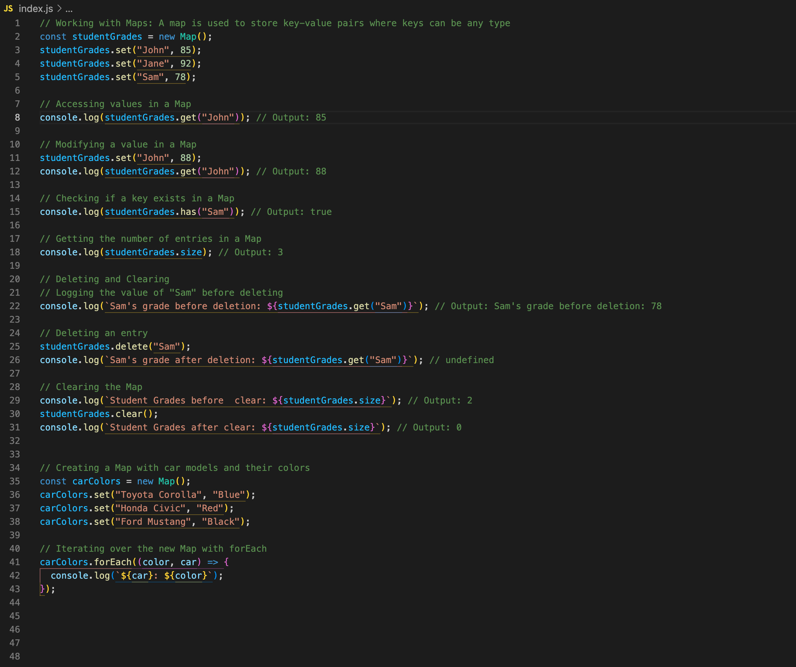

# JavaScript Advanced: Maps and Sets



---

## Description 📄

In this lab, we will explore advanced data structures in JavaScript: **Maps** and **Sets**. These structures, introduced in ES6, offer distinct advantages over traditional arrays and objects for specific programming tasks, such as efficient lookups, ordered key-value pairs, and handling unique data sets.

### Key Concepts Covered:
- **Maps**: Used for storing key-value pairs where keys can be any data type. Maps maintain the insertion order of entries and provide efficient data retrieval.
- **Sets**: Used to store unique values of any type. They automatically filter out duplicates and offer methods for checking and managing items.

### By the end of this lab, you will:
- Understand how to create, modify, and iterate through **Maps** and **Sets**.
- Learn how to convert between arrays, maps, and sets to leverage their unique properties.

## Expected Project Structure 🏗️

Your project should be structured as follows:

```plaintext
javascript-maps-sets/
├── index.js
└── README.md
```

##

### 1. **Create the Project Folder and Files**
   - [ ] Create a project folder named javascript-maps-sets to store your project files.

   - [ ] Inside the javascript-maps-sets folder, create a file named index.js. This will be your main JavaScript file where all your code will be written

##

## 2. **Setting Up Your Map and Set**

Now that you have created the `index.js` file, let's start by initializing a `Map` and adding entries to it.

- [ ] Open the `index.js` file in the `javascript-maps-sets` folder and add the following code to set up a `Map` and populate it with initial data.

```javascript
// Working with Maps: A map is used to store key-value pairs where keys can be any type
const studentGrades = new Map();
studentGrades.set("John", 85);
studentGrades.set("Jane", 92);
studentGrades.set("Sam", 78);
```

**Explanation:**


- **Initialization**: `const studentGrades = new Map();` creates an empty `Map` called `studentGrades`.
- **Adding Entries**:
  - `studentGrades.set("John", 85);` adds an entry with the key `"John"` and the value `85`.
  - `studentGrades.set("Jane", 92);` adds an entry with the key `"Jane"` and the value `92`.
  - `studentGrades.set("Sam", 78);` adds an entry with the key `"Sam"` and the value `78`.

### Visual Representation:
After these operations, the `studentGrades` `Map` will look like:
```javascript
studentGrades {
  "John" => 85,
  "Jane" => 92,
  "Sam" => 78
}
```

##

## 3. **Accessing and Modifying Values in a Map**

Let's move on to accessing values in a `Map` and modifying them. Follow these steps to see how you can retrieve and update values in your `Map`.


- [ ] Add the following code to `index.js` to log the grade of a student:
   ```javascript
   // Accessing values in a Map
   console.log(studentGrades.get("John")); // Output: 85
  ```

 - [ ] Run your code using Node.js in the terminal to test the `get()` method on the `Map`:


    ```bash
    node index.js
    ```

### Expected Output:

```bash
85
```

- [ ] Modify the existing value for `"John"` in the `studentGrades` map and log the updated value:

   ```javascript
   // Modifying a value in a Map
   studentGrades.set("John", 88);
   console.log(studentGrades.get("John")); // Output: 88
  ```

   - [ ] Run your code using Node.js in the terminal to test the `get()` method on the `Map` again:


    ```bash
    node index.js
    ```

### Expected Output:

```bash
88
```

### Explanation:

In this step, we demonstrated how to access and modify values in a `Map` and observed how the output changed as a result:

**Accessing the Initial Value**:
   - The first code snippet logged the value associated with the key `"John"`:

   - **Explanation**: This initial output of `85` confirmed that the key `"John"` existed in the `Map` and had a grade of `85`.

**Modifying the Value**:
   - The second code snippet updated `"John"`'s grade using the `.set()` method:
 
   - **Explanation**: The `.set()` method was used to change the value associated with the key `"John"` from `85` to `88`. The updated value was then logged to confirm the modification.

### Why the Output Changed:
- The `.set()` method updated the existing entry in the `Map`, replacing the old value (`85`) with the new value (`88`). When the `.get("John")` method was called again, it returned `88`, confirming that the update was applied correctly.

This demonstrated how to use `.set()` to modify values in a `Map` and ensured that data retrieval using `.get()` reflects the most recent changes.

##

## 4. **Checking for the Existence of Keys and the Size of a Map**

In this step, we will use methods to check if specific keys exist in the `Map` and determine the number of entries.

- [ ] Add the following code to `index.js` to check if the key `"Sam"` exists in the `studentGrades` map:

   ```javascript
   // Checking if a key exists in a Map
   console.log(studentGrades.has("Sam")); // Output: true
  ```

  ## 5. **Next, Let's Check the Number of Entries in the Map**

- [ ] Use the following code to log the number of key-value pairs in the `studentGrades` map:

```javascript
// Getting the number of entries in a Map
console.log(studentGrades.size); // Output: 3
```

   - [ ] Run your code using Node.js in the terminal:


    ```bash
    node index.js
    ```

### Expected Output:

```bash
true
3
```

### Explanation:

In this section, we used two methods to interact with the `studentGrades` map:

**Checking if a Key Exists**:
   The `.has()` method checks if a specific key is present in the `Map`. The method returned `true`, confirming that the key `"Sam"` exists in the `studentGrades` map.

**Getting the Number of Entries**:
   The `.size` property returns the total number of key-value pairs in the `Map`. The output was `3`, indicating that the `studentGrades` map contains three entries: `"John"`, `"Jane"`, and `"Sam"`.

### Why These Methods Are Useful:
- The `.has()` method is helpful for checking the presence of a key before performing operations that rely on its existence, such as retrieving or updating the value.
- The `.size` property provides an immediate count of the number of entries, which is valuable for validating the number of items stored in the `Map` and determining if the `Map` is empty or populated.

### Output:
When both methods are run together, the combined output will be:
`true` (confirming that the key `"Sam"` exists) and `3` (showing the total number of entries in the `Map`).

These steps demonstrate the effectiveness of `Map` methods for key existence checks and determining the size of a `Map`, making data handling and structure management straightforward.

##

## 5. **Now Let's Look at the Delete and Clear Methods**

In this step, we will explore how to use the `.delete()` and `.clear()` methods on a `Map`.

- [ ] Use the following code to explore the delete and clear methods on the `Map`:

```javascript
// Logging the value of "Sam" before deleting
console.log(`Sam's grade before deletion: ${studentGrades.get("Sam")}`); // Output: Sam's grade before deletion: 78

// Deleting an entry
studentGrades.delete("Sam");
console.log(`Sam's grade after deletion: ${studentGrades.get("Sam")}`); // Output: undefined

// Checking the size before clearing the Map
console.log(`Student Grades before clear: ${studentGrades.size}`); // Output: 2

// Clearing the Map
studentGrades.clear();
console.log(`Student Grades after clear: ${studentGrades.size}`); // Output: 0
```


   - [ ] Run your code using Node.js in the terminal:


    ```bash
    node index.js
    ```

### Expected Output:

```bash
Sam's grade before deletion: 78
Sam's grade after deletion: undefined
Student Grades before clear: 2
Student Grades after clear: 0
```

### Explanation:
**Logging the Value of "Sam" Before Deleting**:
   We use the `.get()` method to check and display the value associated with the key `"Sam"`. This confirms that `"Sam"` exists in the `Map` and shows its current value before any modifications are made.

**Deleting an Entry**:
   The `.delete()` method is used to remove the entry for `"Sam"` from the `Map`. After deletion, calling `.get("Sam")` returns `undefined`, which indicates that the key no longer exists in the `Map`. The `undefined` value in JavaScript signifies that there is no value associated with the specified key.

**Checking the Size Before Clearing**:
   We log the size of the `Map` using the `.size` property to confirm how many key-value pairs remain after deleting `"Sam"`. This helps ensure that the `Map` still contains data before clearing it.

**Clearing the Map**:
   The `.clear()` method removes all entries from the `Map`, resetting it to an empty state. Logging the size of the `Map` after calling `.clear()` confirms that the `Map` has been emptied, as the size will be `0`.

### Summary:
- The `.delete()` method is useful for removing specific entries from a `Map` by their keys.
- The `.clear()` method is used to remove all entries, effectively resetting the `Map`.
- The output `undefined` confirms that an attempt to access a non-existent key returns no value, indicating that the key has been removed from the `Map`.

##

## 6. **Creating Another Map and Using forEach**

In this step, we will create a new `Map` with car models and their colors, and use the `.forEach()` method to iterate over the `Map` and log its contents.

- [ ] Use the following code to create and iterate over a new `Map`:

```javascript
// Creating a Map with car models and their colors
const carColors = new Map();
carColors.set("Toyota Corolla", "Blue");
carColors.set("Honda Civic", "Red");
carColors.set("Ford Mustang", "Black");

// Iterating over the new Map with forEach
carColors.forEach((color, car) => {
  console.log(`${car}: ${color}`);
});
```


   - [ ] Run your code using Node.js in the terminal:


    ```bash
    node index.js
    ```

### Expected Output:

```bash
Tesla Model S: White
BMW 3 Series: Blue
Audi A4: Black

```

### Explanation:

**Creating a New Map**:
   We create a new `Map` to store car models as keys and their corresponding colors as values. This structure allows us to associate each car model with its color in an organized manner.

**Iterating Over the Map with forEach**:
   The `.forEach()` method is used to iterate over the `Map`. The method takes a callback function with two parameters: the `value` (color) and the `key` (car model). This lets us access both the car model and its color during each iteration.

**Logging Each Entry**:
   During the iteration, we log each car model and its color to the console in the format `key: value`. This helps verify that the `Map` has been populated correctly and allows us to see each entry displayed clearly.

**Purpose and Benefits**:
   Using `.forEach()` on a `Map` makes it easy to loop through all key-value pairs, which is useful for displaying data, applying transformations, or performing operations on each entry.

### Summary:
- The `.forEach()` method provides an efficient way to iterate over a `Map` and access each key-value pair.
- Logging during the iteration confirms that data is correctly stored and retrievable.
- This approach demonstrates how to work with `Map` data structures effectively for organized data handling and display.

##

## 7. **Working with Sets and Adding Values**

In this step, we will create a new `Set`, log its initial state, and then add a value to it to demonstrate how `Set` operations work.

- [ ] Use the following code to create and add a value to a `Set`:

```javascript
// Working with Sets: Declare the set before using it
const uniqueNames = new Set();

// Log the initial state of the Set
console.log(uniqueNames); // Output: Set(0) {}

// Add a value to the Set
uniqueNames.add("David");

// Log the Set after adding a value
console.log(uniqueNames); // Output: Set(1) { 'David' }
```


   - [ ] Run your code using Node.js in the terminal:


    ```bash
    node index.js
    ```

### Expected Output:

```bash
Set(0) {}
Set(1) { 'David' }
```

### Explanation:

**Creating the Set**:
   We start by creating a `Set` named `uniqueNames`. A `Set` is a built-in JavaScript data structure used to store unique values, ensuring that no duplicates are present.

**Logging the Initial State**:
   Before adding any values, we log the `Set` to the console. The output `Set(0) {}` confirms that the `Set` is empty and contains zero elements. The `0` indicates the size of the `Set`.

**Adding a Value**:
   We use the `.add()` method to insert the value `"David"` into the `Set`. This method ensures that only unique values are stored. If the value `"David"` had already been present, the `Set` would not have added it again.

**Logging the Set After Adding a Value**:
   After adding `"David"`, we log the `Set` again. The output `Set(1) { 'David' }` indicates that the `Set` now contains one element. The `1` reflects the current size of the `Set`, and `{ 'David' }` shows the stored value.

### Summary:
- A `Set` starts empty, which is confirmed by logging `Set(0) {}`.
- The `.add()` method adds a value to the `Set` while ensuring uniqueness.
- Logging the `Set` after adding a value shows `Set(1) { 'David' }`, confirming that the value has been successfully added and the size has increased to `1`.

##

## 8. **Converting Between Sets and Arrays**

In this step, we will explore how to convert an array to a `Set` to remove duplicates and then convert the `Set` back to an array.

- [ ] Use the following code to convert an array to a `Set` and back to an array:

```javascript
// Converting between Sets and Arrays
const animalsArray = ["dog", "cat", "dog", "bird", "cat"];
const uniqueAnimals = Array.from(new Set(animalsArray));

// Logging the original and unique arrays
console.log(`Animals Array: ${animalsArray}`); // Outputs the full array 
console.log(`UniqueAnimals Array from Set: ${uniqueAnimals}`); // Output: ['dog', 'cat', 'bird']
```


   - [ ] Run your code using Node.js in the terminal:


    ```bash
    node index.js
    ```

### Expected:

```bash
Animals Array: dog,cat,dog,bird,cat
UniqueAnimals Array from Set: dog,cat,bird
```

### Explanation of What Happened:

- **Original Array Creation**:
  - We started with an array called `animalsArray` that included duplicate values: `["dog", "cat", "dog", "bird", "cat"]`.

- **Converting the Array to a Set**:
  - We passed `animalsArray` into `new Set()` to create a `Set` named `uniqueAnimals`. 
  - The `Set` automatically removed duplicate entries, resulting in only unique values being stored: `{"dog", "cat", "bird"}`.

- **Converting the Set Back to an Array**:
  - We used `Array.from(uniqueAnimals)` to convert the `Set` back into an array.
  - This step created an array from the `Set` that maintained only the unique values: `["dog", "cat", "bird"]`.

- **Logging the Original and Unique Arrays**:
  - The first `console.log()` displayed the `animalsArray` in its original state, showing all elements, including duplicates.
  - The second `console.log()` displayed `uniqueAnimals` after conversion, showing the final array with duplicates removed.

### Key Takeaways:
- **Set for Uniqueness**: Using a `Set` is an efficient way to remove duplicates from an array.
- **Array Conversion**: `Array.from()` allows you to convert a `Set` back to an array, preserving the unique elements.
- **Order Preservation**: The order of elements in the `Set` reflects their first appearance in the original array.

##

## 9. **Final Step: Commit and Push Your Project to GitHub**

In this final step, you’ll commit your changes and push your project to GitHub to save and share your work. This ensures that your project is versioned and backed up remotely.

- [ ] **Initialize Git (if not already initialized):**
     ```bash
     git init
     ```

- [ ] **Add All Changes to Staging:**
     ```bash
     git add .
     ```

- [ ] **Commit Your Changes:**
     ```bash
     git commit -m "Add code for working with Maps and Sets, including conversions and iterations"
     ```

- [ ] **Connect to Your GitHub Repository** (if not already connected):
     - Replace `<username>` with your GitHub username and `<repository-name>` with the name of your repository.
     ```bash
     git remote add origin https://github.com/<username>/<repository-name>.git
     ```

- [ ] **Push to GitHub:**
     ```bash
     git push -u origin main
     ```

### Explanation of Step 9: Commit and Push to GitHub

In this step, we committed our changes and pushed the project to GitHub to create a backup and enable version control:

- **Initialized Git**: We used `git init` to start version control in the project folder if it hadn’t been initialized previously.
- **Added Changes to Staging**: The `git add .` command staged all project files, preparing them for the commit.
- **Committed the Changes**: The `git commit` command with a descriptive message recorded the changes in the local repository.
- **Connected to GitHub**: We linked the local repository to a remote repository on GitHub using `git remote add origin`.
- **Pushed to GitHub*


##

## Conclusion 📄

In this lab, you learned how to use **JavaScript Maps and Sets** to efficiently manage collections of data with unique characteristics. By following each step, you gained practical experience with:

- **Creating and manipulating Maps** to store and access key-value pairs, allowing for dynamic data management with methods like `.set()`, `.get()`, `.delete()`, and `.clear()`.
- **Using Sets** to store unique values, ensuring that duplicates are automatically filtered out while supporting operations like `.add()` and `.forEach()` for iteration.
- **Converting between Sets and Arrays** to leverage the benefits of both data structures, such as removing duplicates from an array and converting a Set back to an array for further manipulation.
- **Iterating over Maps and Sets** using methods like `.forEach()` to access and display entries in a clear, organized manner.

### Key Takeaways:
- **Efficient Data Storage with Unique Constraints**: Maps and Sets provide powerful tools for managing data collections, especially when working with unique keys and values or when performance and order are important.
- **Readable and Maintainable Code**: By using Maps and Sets, you create more readable and maintainable code structures, especially when compared to plain objects and arrays for complex data operations.
- **Flexible Data Conversion**: The ability to convert arrays to Sets and back enables you to handle data cleanup, such as removing duplicates, while maintaining compatibility with array methods for more extensive data processing.

With these skills, you’re now equipped to use **JavaScript Maps and Sets** to handle unique collections of data, streamline operations, and enhance the maintainability and scalability of your code. Continue practicing by implementing these structures in different scenarios and combining them with other JavaScript features to build more robust and flexible applications!


### Solution codebase 👀
🛑 **Only use this as a reference** 🛑

💾 **Not something to copy and paste** 💾

**Note:**  This lab references a solution file located [here](https://github.com/HackerUSA-CE/aisd-ajs-04-maps-sets/tree/solution) (link not shown).

---
© All rights reserved to ThriveDX

